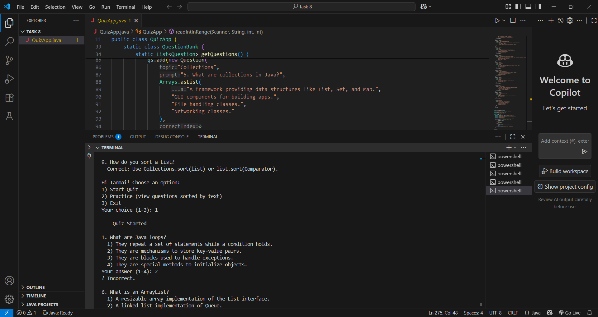

# 🎯 Java Terminal Trivia – Console Quiz Game

## 📖 Overview
**Java Terminal Trivia** is a fun and interactive console-based quiz game built using Java.  
Players answer a series of multiple-choice questions, and the program instantly evaluates responses to show their score.  
This project is perfect for practicing **Java basics**, control flow, arrays, and handling user input through the console.

## 🎯 Objective
- Create a trivia-style quiz with predefined questions.
- Accept and process user answers from the console.
- Display the final score and correct answers to enhance learning.

## 🛠 Tools Used
- **Java** – Main programming language.
- **Console** – For text-based input/output interaction.

## 📂 Deliverables
- Java class for storing and managing **quiz questions**.
- Java class for calculating and displaying **results**.

## 🖼 Screenshot  

## 📌 Repository Link
[Java Terminal Trivia – Console Quiz Game](https://github.com/Hemasripatkuri4/java-terminal-trivia/tree/main)

## 👩‍💻 Author
**Hemasripatkuri4** – Passionate learner and budding Java developer, building skills through practical console-based projects.

---
Happy Coding! 🚀

